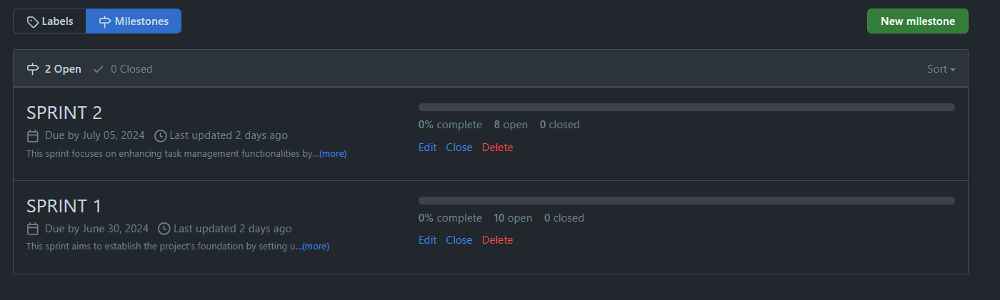
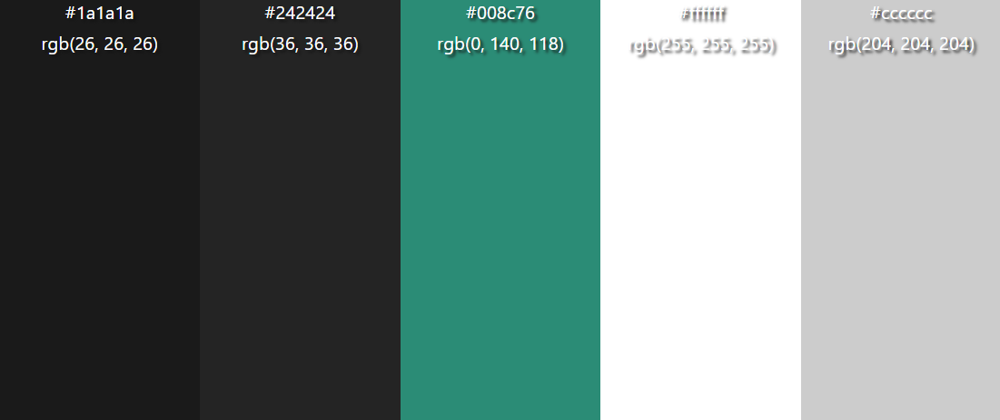
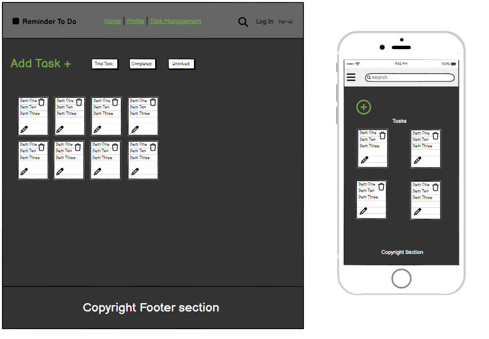

# Reminder To Do

            Did you forget again?

Reminder To Do is a straightforward CRUD (Create, Read, Update, Delete) application designed to facilitate task management through personalized to-do lists and reminders. Targeted at users seeking an efficient way to organize their tasks, the application allows seamless account creation and login functionalities. Once authenticated, users can create, update, and delete tasks, set reminders, and manage their schedules effectively. Powered by an integrated Supabase database, Reminder To Do ensures data security and scalability, providing a user-friendly interface for streamlined task management.


Developer: [Kim Bergström](https://github.com/KimBergstroem) <br>
[Live webpage](https://reminder-to-do-app.netlify.app/)<br>
[Project Repository](https://github.com/KimBergstroem/to-do-app)<br>


## <span id="readme-top">**Table of Content**</span>

- 📄[**User Experience UX**](#user-experience-ux)

  - [Target Audience](#target-audience)
  - [User Requirements and Expectations](#user-requirements-and-expectations)

- 📄[**Methodology**](#methodology)

  - [Agile Project Management with GitHub Projects and Trello](#agile-project-management-with-github-projects-and-trello)
  - [Individual Task Management with Trello](#individual-task-management-with-trello)
  - [User Stories as GitHub Issues](#user-stories-as-github-issues)
  - [Iterative Development Approach](#iterative-development-approach)
  - [User Stories](#user-stories)
  - [Bug Tracking for Seamless Development](#bug-tracking-for-seamless-development)
  - [Future Backlog and Progress](#future-backlog-and-progress)

- 📄[**Database**](#database)

- 📄 [**Design**](#design)

  - [Colour Scheme](#colour-scheme)
  - [Typography](#typography)
  - [Imagery](#imagery)
  - [Wireframes](#wireframes)

- 📄 [**Features**](#features)

  - [Future Implementations](#future-implementations)
  - [Accessibility](#accessibility)

- [**Technologies Used**](#technologies-used)

  - [Languages](#languages)
  - [Frameworks](#frameworks)
  - [Database](#database-1)
  - [Tools](#tools)
  - [Supporting Libraries and Packages](#supporting-libraries-and-packages)

- 📄[**Deployment**](#deployment)

  - [App Deployment](#app-deployment)
  - [Version Control](#version-control)
  - [Forking the Repository](#forking-the-repository)
  - [Clone of the Repository](#clone-of-the-repository)

- 📄 [**Testing**](#testing)

  - [Solved Bugs](#solved-bugs)
  - [Known Bugs](#known-bugs)

- 📄 [**Credits**](#credits)
  - [Code Used](#code-used)
  - [Content](#content)
  - [Media](#media)
  - [Acknowledgments](#acknowledgments)
  - [License](#license)

<p align="center">
  
</p>

# **User Experience (UX)**

### Target Audience

Reminder To Do is designed for the following target audience:

- Individuals seeking an efficient solution for organizing and managing their tasks and reminders.
- Users looking for a user-friendly application to create personalized to-do lists.
- Professionals and students aiming to streamline their daily task management.
- Anyone interested in utilizing reminders for better time management and productivity.
- Individuals who prefer a simple yet effective tool for organizing their schedules.

### User Requirements and Expectations

When using Reminder To Do, users can expect the following features and characteristics to meet their needs:

- A straightforward and intuitive interface for creating, editing, and deleting tasks.
- Seamless account creation and login functionalities to personalize task lists.
- Ability to set reminders and due dates to stay organized and on track.
- Reliable storage and retrieval of task data through an integrated database solution.
- Responsive design ensuring optimal user experience across desktop and mobile devices.
- Data security measures to protect user information and task details.
- Regular updates and improvements to enhance functionality and user satisfaction.

### Overview

Reminder To Do provides an intuitive platform for users to efficiently manage their tasks and reminders in a fun and effective manner. It features a robust, user-friendly interface designed to enhance productivity and organization across various domains.

<p align="right">(<a href="#readme-top">back to top</a>)</p>
<p align="center">
  
</p>

# Methodology

The Reminder To Do project follows a methodology inspired by AGILE principles, fostering collaboration, flexibility, and gradual development. The outlined approach has guided the project's evolution.

### Agile Project Management with GitHub Projects

To streamline project management, GitHub Projects is employed as a central hub. User stories and tasks are structured as GitHub issues, creating an organized workflow. The GitHub project board serves as a visual representation, tracking progress effectively.

### Individual Task Management with Trello

To manage daily tasks efficiently, Trello, a desktop application, complements GitHub Projects. For instance, when assigned a user story with multiple tasks, these tasks are imported into Trello for detailed management. Linnk to Trello can be found [here](https://www.trello.com/)

### User Stories as GitHub Issues

Transforming user stories into GitHub issues captures user-centric functionalities. These issues interlink with respective user stories, simplifying access to criteria, tasks, and discussions.

### Iterative Development Approach

The Reminder To Do project adheres to an iterative development approach, facilitating continuous enhancements within a predefined timeline. Despite its condensed schedule, the project accommodates future iterations and expansions.

To ensure efficient prioritization, our project employs the MuSCoW (Must have, Should have, Could have, Won't have) method. User stories critical to the app's success are categorized as Must-haves, followed by Should-haves, Could-haves, and Won't-haves. You can refer to our [Kanban board](https://github.com/users/KimBergstroem/projects/12) to view the prioritization.

Within each sprint, a MoSCoW method is used to further prioritize user stories. They are classified as Must Do, Should Do, Could Do, and Won't Do, representing the remaining user stories that will not be included in the sprints. This approach ensures a clear differentiation between our overall project prioritization and the prioritization within each sprint, minimizing any potential confusion.

**Labels and User Story Distribution (MoSCoW):**

- **Must-Have:** 6/11
- **Should-Have:** 3/11
- **Could-Have:** 1/11
- **Wont-Have:** 1/11
- **Task:** 4
- **Documentation:** 4

<br>

### User Stories

<h3 align="center">SPRINT 1 (June 26th - June 29th, 2024)</h3>

- [Planning and Documentation](https://github.com/KimBergstroem/to-do-app/issues/1)
- [Set Up Project Skeleton](https://github.com/KimBergstroem/to-do-app/issues/2)

#### Epic 1: Authentication [#3](https://github.com/KimBergstroem/to-do-app/issues/3)

- <a href="https://github.com/KimBergstroem/to-do-app/issues/6" style="text-decoration:none">USER STORY: Create an Account</a> _(must-have)_
- <a href="https://github.com/KimBergstroem/to-do-app/issues/7" style="text-decoration:none">USER STORY: Log in to the App</a> _(must-have)_
- <a href="https://github.com/KimBergstroem/to-do-app/issues/8" style="text-decoration:none">USER STORY: Log out from the App</a> _(must-have)_

#### Epic 2: Task Management [#4](https://github.com/KimBergstroem/to-do-app/issues/4)

- <a href="https://github.com/KimBergstroem/to-do-app/issues/9" style="text-decoration:none">USER STORY: Add a New Task</a> _(must-have)_
- <a href="https://github.com/KimBergstroem/to-do-app/issues/10" style="text-decoration:none">USER STORY: Edit a Task</a> _(must-have)_
- <a href="https://github.com/KimBergstroem/to-do-app/issues/11" style="text-decoration:none">USER STORY: Delete a Task</a> _(must-have)_
- <a href="https://github.com/KimBergstroem/to-do-app/issues/12" style="text-decoration:none">USER STORY: Mark a Task as Complete</a> _(should-have)_

After completing sprint 1, the project will be ready for its initial demonstration, showcasing the Minimum Viable Product (MVP). This milestone will be reached one week after the start of development.

<br>

<h3 align="center">SPRINT 2 (June 30th - July 05, 2024)</h3>

#### Epic 2: Task Management [#4](https://github.com/KimBergstroem/to-do-app/issues/4)

- <a href="https://github.com/KimBergstroem/to-do-app/issues/13" style="text-decoration:none">USER STORY: View Task Details</a> _(could-have)_
- <a href="https://github.com/KimBergstroem/to-do-app/issues/14" style="text-decoration:none">USER STORY: Set Task Priority</a> _(should-have)_

#### Epic 3: User Enchancement [#5](https://github.com/KimBergstroem/to-do-app/issues/5)

- <a href="https://github.com/KimBergstroem/to-do-app/issues/15" style="text-decoration:none">USER STORY: Search Tasks</a> _(wont-have)_
- <a href="https://github.com/KimBergstroem/to-do-app/issues/16" style="text-decoration:none">USER STORY: Filter Tasks</a> _(should-have)_

- [Final Testing and Bug Fixes](https://github.com/KimBergstroem/to-do-app/issues/18)
- [Final Documentation](https://github.com/KimBergstroem/to-do-app/issues/18)

---

The **11** user stories are implemented into **4** Epics and they are organized into **2** distinct sprints (milestones) to establish a well-defined work structure. You can access the details of these sprints by clicking [here](https://github.com/KimBergstroem/to-do-app/milestones), which will redirect you to the sprint information and find all the user stories and epics.

<p align="center">
  
</p>

### Bug Tracking for Seamless Development

Bugs uncovered during development are documented as GitHub issues, offering insights into each bug's characteristics, impact, and reproduction steps. By hyperlinking these issues in README.md, users can stay updated on bug resolutions and contribute insights.

### Future Backlog and Progress

The project board efficiently manages user stories, with the "Not started" column representing upcoming iterations. This backlog previews user stories set for subsequent development phases.

Emphasizing that the project timeline is expedited, the iterative approach maintains adaptability, enabling ongoing refinements and improvements aligned with evolving user needs.

<p align="right">(<a href="#readme-top">back to top</a>)</p>
<p align="center">
  
</p>

# **Database**

The Reminder To Do application utilizes Supabase for its backend infrastructure, particularly for user authentication and data management. Supabase offers a comprehensive solution that significantly simplifies the development process by providing ready-made authentication mechanisms and database functionalities. This choice allows the project to focus more on core functionalities and user experience enhancements rather than spending time on building and managing custom database tables and authentication systems. By leveraging Supabase, the application benefits from robust security, seamless scalability, and efficient data handling, ensuring a reliable foundation for user interaction and data management.

<p align="right">(<a href="#readme-top">back to top</a>)</p>
<p align="center">
  
</p>

# **Design**

### **Colour Scheme**

<p align="center">
  
</p>

**Dominant (50%):**

Our dominant color, which constitutes 50% of our color palette, is a deep and sophisticated shade of dark gray (#1A1A1A). It forms the primary background of our application, providing a visually appealing canvas that enhances readability and user focus. This dark gray tone creates a modern and elegant atmosphere, ensuring a comfortable viewing experience even during extended use.

**Secondary (30%):**

The secondary color, occupying 30% of our color palette, is a slightly lighter shade of gray (#242424). This color is used for content areas and provides contrast against the dominant background while maintaining a cohesive and harmonious dark theme. It serves as an effective backdrop for text and images, offering clarity and readability across various sections of the application.

**Accent (10%):**

Our accent color, comprising 10% of our color palette, features a refreshing shade of teal (#008C76). This accent color is strategically applied to interactive elements such as buttons and links, adding vibrancy and visual interest to key features and calls to action. Its distinctive hue stands out against the darker background tones, guiding user interactions and enhancing the overall user experience.

&nbsp;

### **Typography**

Google Fonts was used for the following fonts:

- **Cinzel** was selected for headings and larger text elements across the site. It boasts elegant serif letterforms, lending a touch of sophistication to the design.


- **Roboto** serves as the primary typeface for body text, including paragraphs containing questions and answers. Developed by Christian Robertson, Roboto is a versatile sans-serif font known for its clean, modern appearance and excellent legibility.


&nbsp;

### **Imagery**

All the images were modified by me in Photoshop or Canva.

&nbsp;

### **Wireframes**

A very basic wireframe was created using the [Balsamiq](https://balsamiq.cloud/) web application. This wireframe serves as a preliminary design blueprint, offering a simplified visual representation of the project's layout and structure. Given the project's relatively small scale, the wireframe provides a clear and concise overview without delving into intricate design details.

The primary focus of this project is on functionality and responsiveness. The wireframe aids in outlining the essential elements and their placement, ensuring a user-friendly interface and seamless navigation. By emphasizing core functionalities and responsive design, the project aims to deliver an efficient and accessible user experience across various devices.

<p align="center">
  
</p>

<p align="right">(<a href="#readme-top">back to top</a>)</p>
<p align="center">
  
</p>

# **Features**

### **Accessibility**

I have been mindful during coding to ensure that the website is as accessible friendly as possible. I have achieved this by:

- Using semantic HTML elements as, header(), section(), nav().
- Declare the Language in the beginning of every html page.
- Using descriptive ALT attributes on images and links on the site.
- Using a hover state on all buttons on the site to make it clear to the user if they are hovering over a button or not.
- Providing information for screen readers where there are icons used and no text.
- Ensuring that there is a sufficient colour contrast throughout the site.
- Ensuring menus are accessible by marking the current page as current for screen readers.

<p align="right">(<a href="#readme-top">back to top</a>)</p>
<p align="center">
  
</p>

# **Technologies Used**

### Languages

- HTML
- CSS
- JavaScript

### Frameworks

- **Vue.js:** A progressive JavaScript framework used for building user interfaces and single-page applications. Vue.js offers a reactive data binding system, making it easier to develop dynamic and interactive web applications.
- **Bootstrap v5.0:** A popular CSS framework used for creating responsive and visually appealing user interfaces.

### Database

- **Supabase:** An open-source Firebase alternative providing all backend services required to build a web or mobile application. It includes features for user authentication, database management, and real-time subscriptions.

### Tools

- **Git:** A distributed version control system used for tracking changes in the project's source code.
- **GitHub:** A web-based hosting service for version control repositories, used for storing and managing the project's source code.
- **Visual Studio Code:** A free source-code editor made by Microsoft for Windows, Linux, and macOS. It includes support for debugging, embedded Git control, syntax highlighting, intelligent code completion, snippets, and code refactoring.
- **Netlify:** A platform for automating modern web projects, providing continuous deployment, serverless functions, and a global application delivery network for performant and secure web applications.
- **Google Fonts:** A collection of free and open-source fonts used for typography in the Reminder To Do application.
- **Font Awesome:** A library of icons used for adding scalable vector icons to the Reminder To Do application.

### Supporting Libraries and Packages

```json
"dependencies": {
  "@supabase/supabase-js": "^1.31.1",
  "bootstrap": "^5.3.3",
  "moment": "^2.29.4",
  "pinia": "^2.0.17",
  "pinia-plugin-persist": "^1.0.0",
  "vue": "^3.2.37",
  "vue-router": "^4.1.3"
}
```

<p align="right">(<a href="#readme-top">back to top</a>)</p>
<p align="center">
  
</p>

# **Deployment & Local Development**

### App Deployment

For deploying your app, Netlify is used. Follow these steps:

**Create a New Site:**

- Create a new site on Netlify by linking it to your GitHub repository.

**Configure Site Settings:**

- Navigate to the "Site settings" of your new site on Netlify.

**Environment Variable Setup:**

- In the "Build & deploy" settings, add the necessary environment variables for Supabase and other configurations. For example, add `VITE_SUPABASE_URL` and `VITE_SUPABASE_ANON_KEY` with the corresponding values from your Supabase project.

**Continuous Deployment:**

- Netlify will automatically configure continuous deployment, pulling changes from your GitHub repository and redeploying the site with each push.

### Version Control

To manage version control and push code to the main repository on GitHub using Visual Studio, follow these steps:

**Add Changes:**

- In Visual Studio, use the built-in Git tools to stage changes. This can be done through the Git Changes window by selecting the files you want to stage and clicking the "+" button.

**Commit Changes:**

- Commit changes with a descriptive comment using the commit message box in the Git Changes window and clicking the commit button.

**Push to GitHub:**

- Push the updates to the repository on GitHub by clicking the "Push" button in the Git Changes window.

**Migrate Models:**

- In the terminal, migrate the models to the new database connection.

### Forking the Repository

By forking the GitHub Repository, you can create a copy of the original repository without affecting the original. Follow these steps:

**GitHub Account Setup:**

- Log into your GitHub account or create one if you don't have one.

**Locate the Repository:**

- Find the repository at [https://github.com/KimBergstroem/to-do-app](https://github.com/KimBergstroem/to-do-app).

**Fork the Repository:**

- At the top right of the repository page, click "Fork" to create a copy in your own GitHub repository.

### Clone of the Repository:

Creating a clone allows you to have a local copy of the project. Follow these steps:

**Repository URL:**

- Navigate to [https://github.com/KimBergstroem/to-do-app](https://github.com/KimBergstroem/to-do-app).
- Click the green "Code" button at the top right.

**Clone the Repository:**

- Select the "Clone by HTTPS" option and copy the provided URL to the clipboard.

**Terminal and Git:**

- Open your code editor or terminal and navigate to the directory where you want to clone the repository.
- Run `git clone` followed by the copied URL.
- Press enter, and Git will clone the repository to your local machine.

To fork the repository, follow these steps:

1. Go to the GitHub repository.
2. Click on the Fork button in the upper right-hand corner.
3. Wait for the forking process to complete. Once done, you will have a copy of the repository in your GitHub account.

To clone the repository, follow these steps:

1. Go to the GitHub repository.
2. Locate the Code button above the list of files and click it.
3. Select your preferred method for cloning: HTTPS, SSH, or GitHub CLI, and click the copy button to copy the repository URL to your clipboard.
4. Open Git Bash (or your preferred terminal).
5. Change the current working directory to the location where you want the cloned directory to be created.
6. Type the command `git clone` followed by the URL you copied in step 3. The command should look like this: `git clone https://github.com/YOUR-USERNAME/YOUR-REPOSITORY`.
7. Press Enter to create your local clone.

<p align="right">(<a href="#readme-top">back to top</a>)</p>
<p align="center">
  
</p>

# **Testing**

All testing was carried out in [Testing.md](TESTING.md).

&nbsp;

### Solved Bugs

| Type      | Bug     | Solution |
| --------- | ------- | -------- |
| Script.js | Example | Example  |
| Script.js | Example | Example  |

&nbsp;

### Known Bugs

| Type      | Bug     | Solution |
| --------- | ------- | -------- |
| Script.js | Example | Example  |
| Script.js | Example | Example  |

&nbsp;

<p align="right">(<a href="#readme-top">back to top</a>)</p>
<p align="center">
  
</p>

# **Credits**

### **Code Used**

&nbsp;

### **Content**

Paragraphs / text for the webpage/readme was written together with [ChatGPT](https://chat.openai.com/)

&nbsp;

### **Media**

&nbsp;

### **Acknowledgments**

I'd like to give recognition to the individuals who supported me in finishing this project:

&nbsp;

### **License**

This project is licensed under the MIT License - see the [LICENSE](LICENSE) file for details.

<p align="right">(<a href="#readme-top">back to top</a>)</p>
<p align="center">
  
</p>
