# Reminder To Do Testing

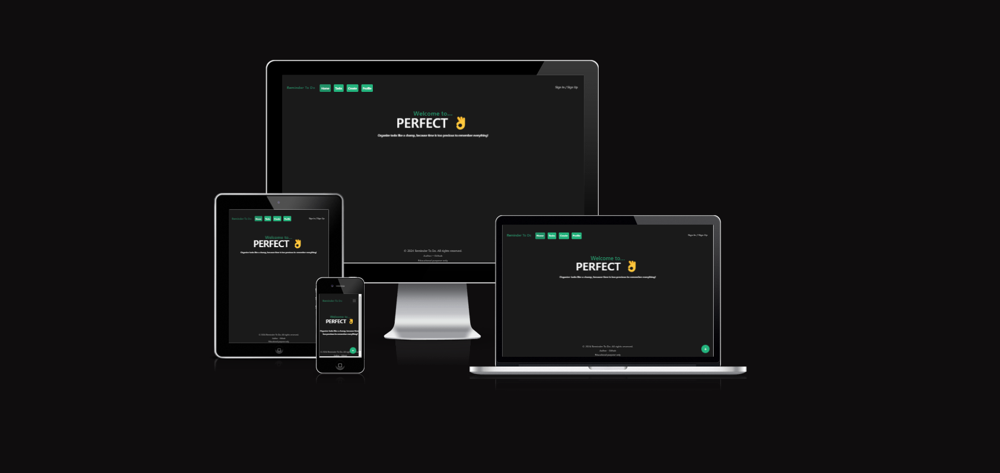

Developer: [Kim Bergström](https://github.com/KimBergstroem)  
[Live webpage](https://reminder-to-do-app.netlify.app/) 
[Project Repository](https://github.com/KimBergstroem/to-do-app) 

## Table of Content

- 📄[**Code Validation**](#code-validation)
  - [HTML Validation](#html-validation)
  - [CSS Validation](#css-validation)
  - [JAVASCRIPT Validation](#javascript-validation)
- 📄[**Accessibility**](#accessibility)
  - [Wave](#--wave--)
- 📄[**Performance**](#performance)
  - [Desktop Performance](#desktop-performance)
  - [Mobile Performance](#mobile-performance)
- 📄[**Performing tests on various devices**](#performing-tests-on-various-devices)
- 📄[**Browser compatibility**](#browser-compatibility)
- 📄[**Manual Testing**](#manual-testing)
  - [Testing user stories](#testing-user-stories)
  - [User Experience and Improvements](#user-experience-and-improvements)
- 📄[**Summary**](#summary)

  

## Code Validation

### HTML Validation

W3C Markup Validation is a service offered by W3C, which enables you to assess the compliance of your HTML code with the official standards. This service identifies syntax errors, improper tag usage, and other issues that might impact the structure and meaning of your web pages. By utilizing W3C Markup Validation, you can ensure that your HTML code is well-structured and conforms to established web standards.

Google Chrome web browser and the 'Inspect' function were used to capture the HTML page from the webb applications templates, which was then validated against the W3C Validator.

Two error codes were ignored during the validation process as they are inherent to the Vue framework and do not affect the functionality of the application:

- `Start tag seen without seeing a doctype first. Expected <!DOCTYPE html>`
- `The type attribute for the style element is not needed and should be omitted. (10)`

| **Tested**             | **Result**                 | **View Result**                                                                                 | **Pass** |
| ---------------------- | -------------------------- | ----------------------------------------------------------------------------------------------- | :------: |
| **Components / Views** |
| HomeView           | All clear, no errors found | 

Screenshot of result
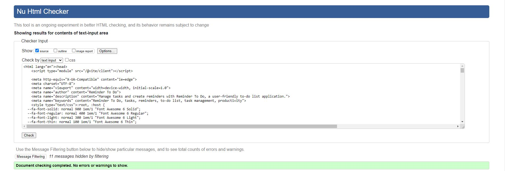
 |    ✅    |
| ProfileView        | All clear, no errors found | 

Screenshot of result
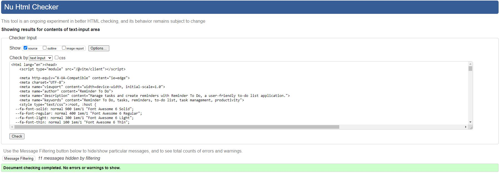
 |    ✅    |
| ProfileEdit       | All clear, no errors found | 

Screenshot of result
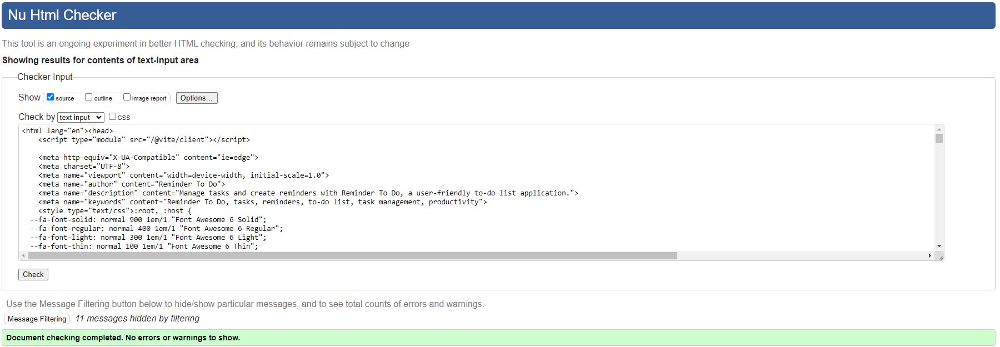
 |    ✅    |
| TaskView           | All clear, no errors found | 

Screenshot of result
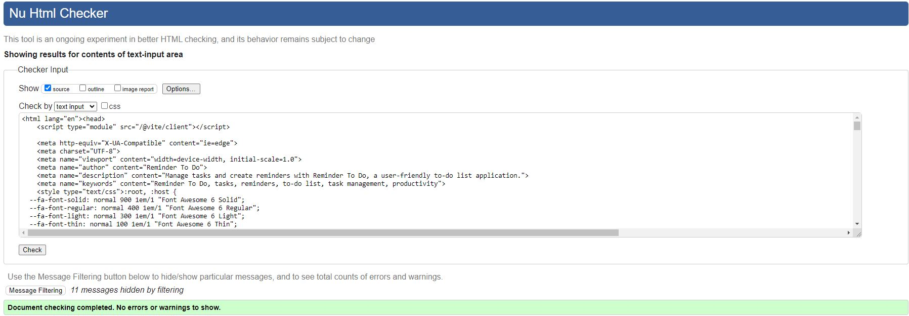
 |    ✅    |
| TaskCreate        | All clear, no errors found | 

Screenshot of result
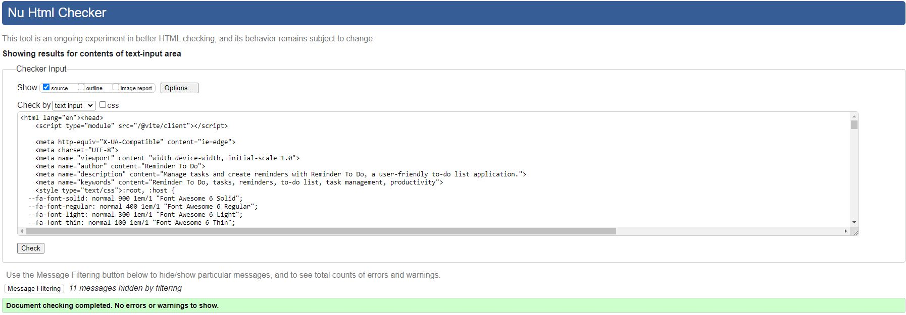
 |    ✅    |
| TaskDetailView     | All clear, no errors found | 

Screenshot of result
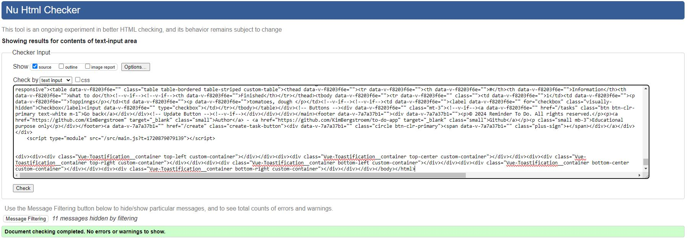
 |    ✅    |
| SignIn.vue             | All clear, no errors found | 

Screenshot of result
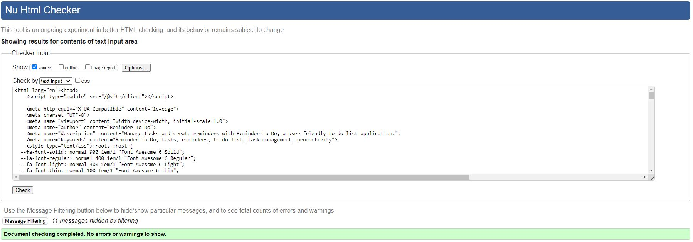
 |    ✅    |
| SignUp.vue             | All clear, no errors found | 

Screenshot of result
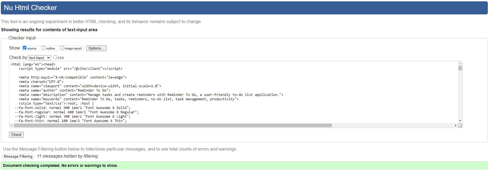
 |    ✅    |

### CSS Validation

[W3C Jigsaw](https://jigsaw.w3.org/css-validator/) is a tool provided by the World Wide Web Consortium (W3C) that allows you to validate and check the correctness of your HTML and CSS code. It helps ensure that your web pages comply with the standards set by the W3C, promoting interoperability and accessibility.

| **Tested** | **Result**            | **View Result**                                                                                 | **Pass** |
| ---------- | --------------------- | ----------------------------------------------------------------------------------------------- | :------: |
| main.css   | No errors or warnings | 

Screenshot of result
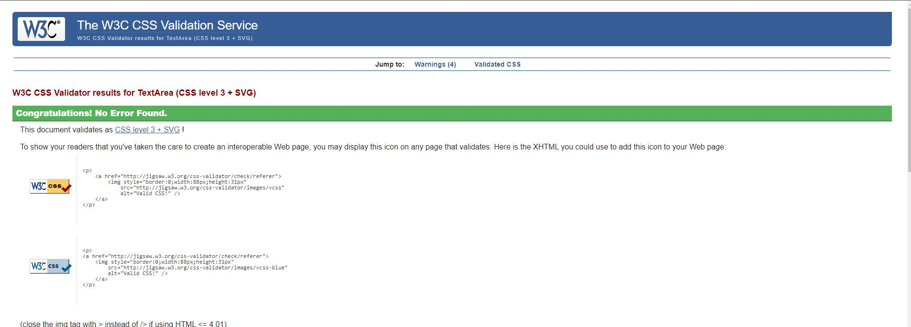
 |    ✅    |

### JAVASCRIPT Validation

[JSHint](https://jshint.com/) is a robust JavaScript code analysis tool that aids in improving the quality and reliability of your JavaScript code. It serves as a linter, helping you catch potential errors, enforce coding conventions, and enhance the overall maintainability of your code.
Taking full JS files from the project folder, but also JavaScript snippets in different Components.vue files where there is JavaScript code for validation of the JS code. Below, you can find the file path along with errors and passes.

Below you can see the errors that was showing on one script of userStore.js that was embedded with import from the .env file for secret key. Besides from this error, all javascript was passing without any errors. I was passing /* jshint esversion: 11 */ as comment on all js files before validating them.

- `import.meta may only be used in module code.`

| **Tested**              | **Result**            | **View Result**                                                                                 | **Pass** |
| ----------------------- | --------------------- | ----------------------------------------------------------------------------------------------- | :------: |
| Router - index.js                | No errors or warnings | 

Screenshot of result
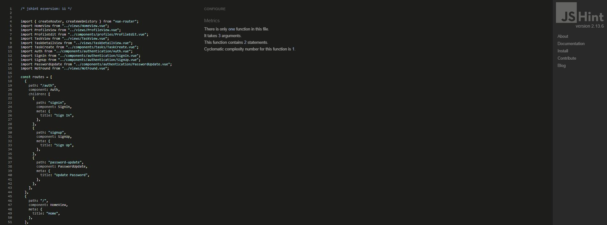
 |    ✅    |
| main.js                 | No errors or warnings | 

Screenshot of result
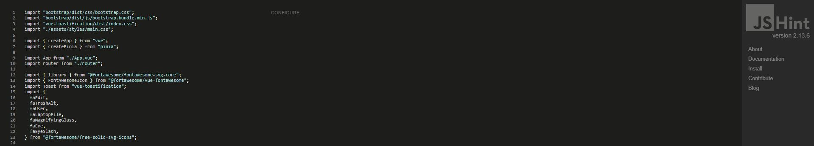
 |    ✅    |
| taskStore.js            | No errors or warnings | 

Screenshot of result
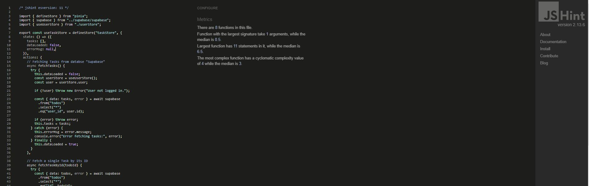
 |    ✅    |
| userStore.js            | No errors or warnings | 

Screenshot of result
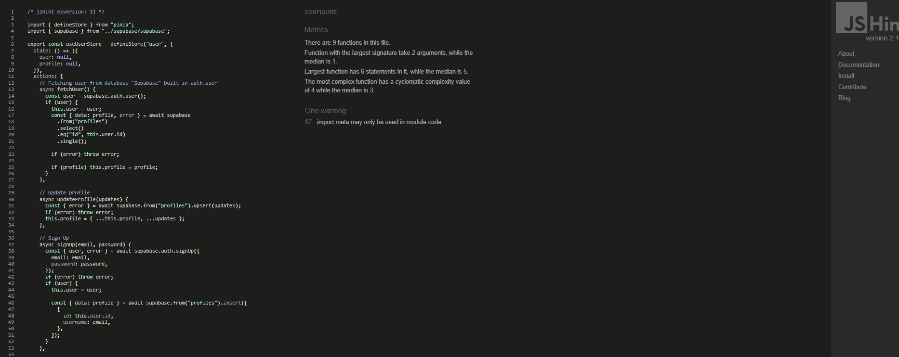
 |    ✅    |
| validateAuthData.js     | No errors or warnings | 

Screenshot of result
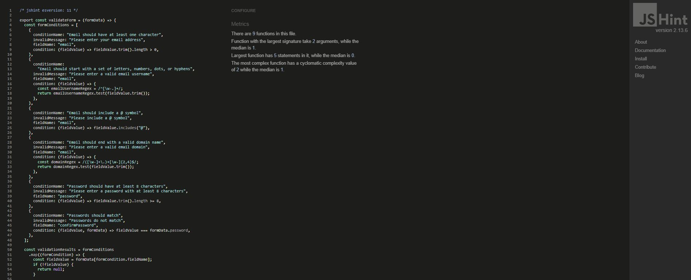
 |    ✅    |
| validateProfileData.js  | No errors or warnings | 

Screenshot of result
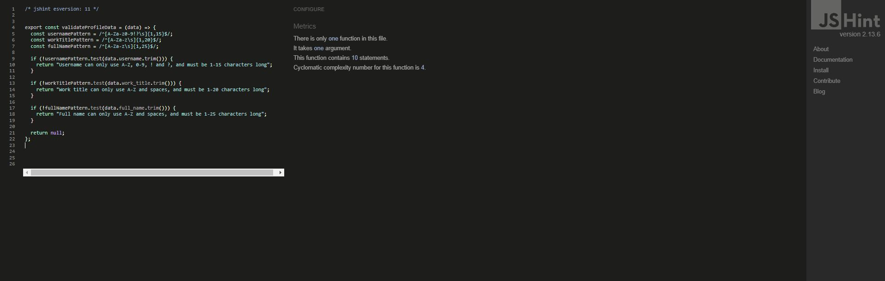
 |    ✅    |
| validateTaskData.js | No errors or warnings | 

Screenshot of result
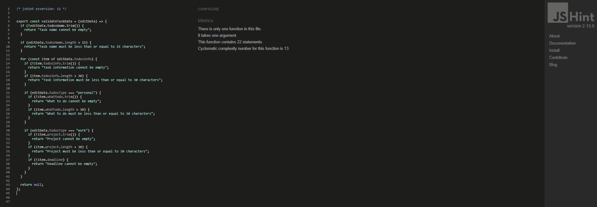
 |    ✅    |

(<a href="#table-of-content">back to top</a>)

  

## Accessibility

### **Wave**

[The WAVE Web Accessibility Evaluation Tool](https://wave.webaim.org/) was used to assess the accessibility of the website. WAVE helps identify potential accessibility issues and provides guidance on how to improve the accessibility of web content.

During the evaluation, the following issues were identified:

- **Errors**: Six errors were found related to missing labels for inputs. These were immediately addressed, and there are now no errors in the application. All input elements have corresponding labels, ensuring better accessibility for users.

- **Contrast Warning**: Five warnings were noted due to insufficient contrast between white text and the green background on buttons. Although this color scheme does not meet the recommended contrast ratio standards, we have opted to retain it for aesthetic reasons. However, improving the background color contrast remains a potential future enhancement to further boost the application's accessibility and usability.

  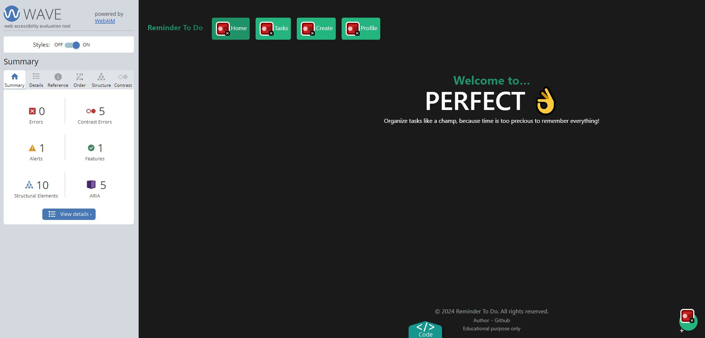

By using the WAVE tool, I gained valuable insights into the accessibility of my website. While I have chosen not to address certain errors at this time, I remain committed to creating an inclusive user experience and will continue to explore ways to improve accessibility in the future.

(<a href="#table-of-content">back to top</a>)

  

## Performance

I conducted a comprehensive evaluation of [The Reminder To Do website](https://next.com/) using [Google Lighthouse in Google Chrome Developer Tools](https://developer.chrome.com/docs/lighthouse/). This evaluation was performed in Google Chrome browser's incognito mode to eliminate all potential impacts from other addons and cached files.

The performance scores were assessed for both desktop and mobile devices. Below are the summarized results:

### Desktop Performance

- Average performance score: 100 / 100
- The majority of pages received score 100 / 100, indicating excellent performance.

| **Tested**             | **Performance Score** | **View Result**                                                                                 | **Pass** |
| ---------------------- | --------------------- | ----------------------------------------------------------------------------------------------- | :------: |
| **Components / Views** |
| HomeView               | 100 / 100              | 

Screenshot of result
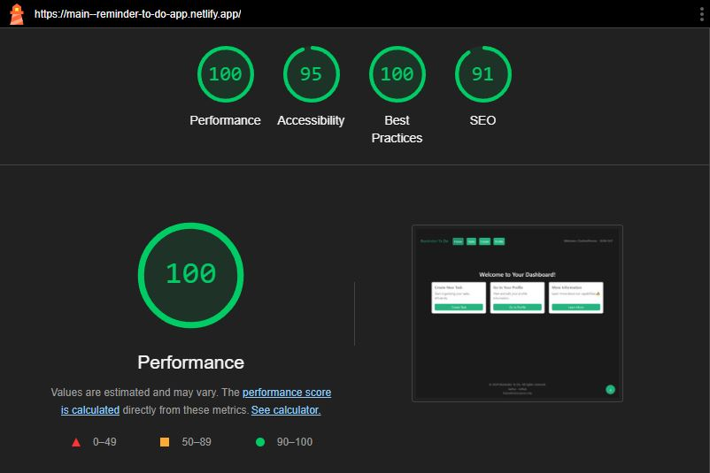
 |    ✅    |
| TaskView            | 100 / 100              | 

Screenshot of result
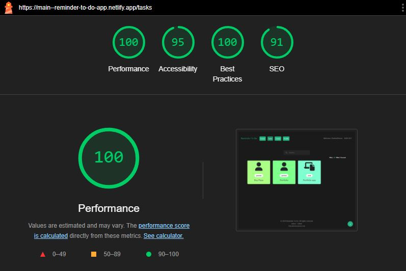
 |    ✅    |
| CreateTaskView            | 100 / 100              | 

Screenshot of result
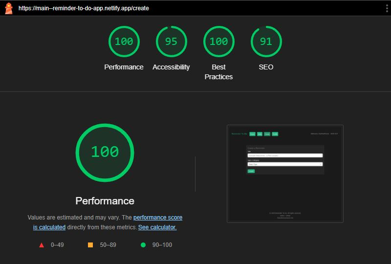
 |    ✅    |
| ProfileView            | 100 / 100              | 

Screenshot of result
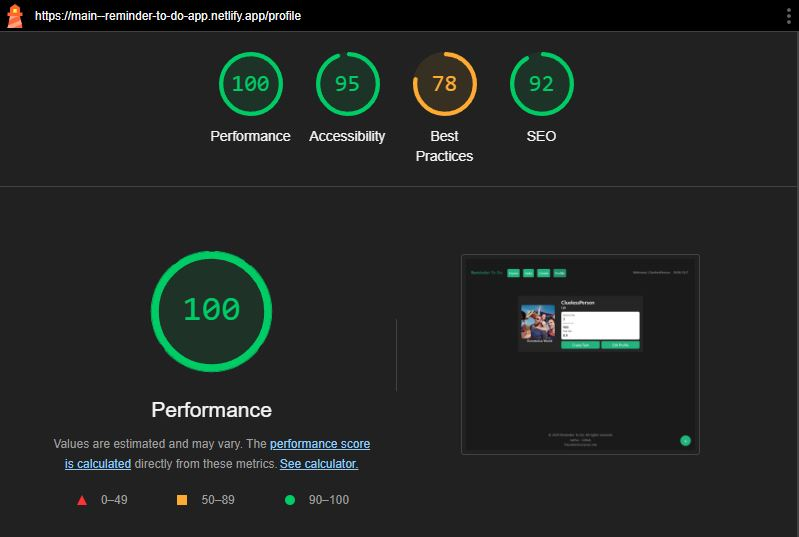
 |    ✅    |
| SignUpView             | 100 / 100              | 

Screenshot of result
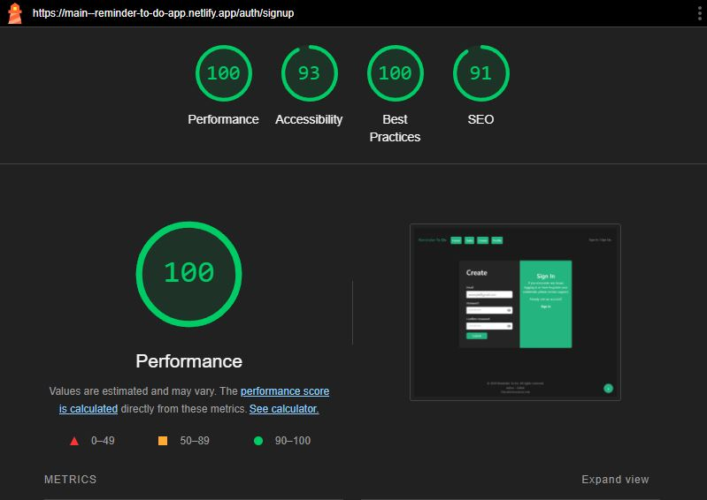
 |    ✅    |
| SignInView             | 100 / 100              | 

Screenshot of result
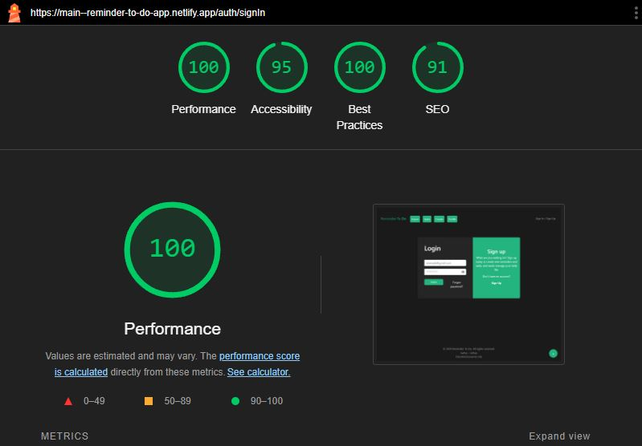
 |    ✅    |

### Mobile Performance

- Average performance score: 97.6 / 100
- The pages showed slightly lower performance compared to the desktop but still maintained a satisfactory score.

| **Tested**             | **Performance Score** | **View Result**                                                                                 | **Pass** |
| ---------------------- | --------------------- | ----------------------------------------------------------------------------------------------- | :------: |
| **Components / Views** |
| HomeView               | 98 / 100              | 

Screenshot of result
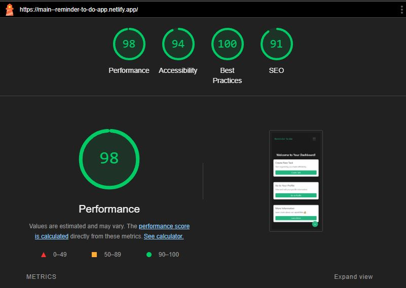
 |    ✅    |
| TaskView            | 98 / 100              | 

Screenshot of result
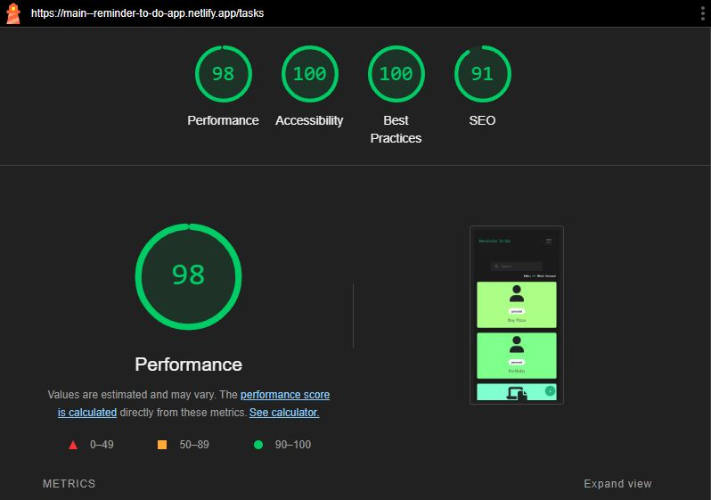
 |    ✅    |
| CreateTaskView            | 98 / 100              | 

Screenshot of result
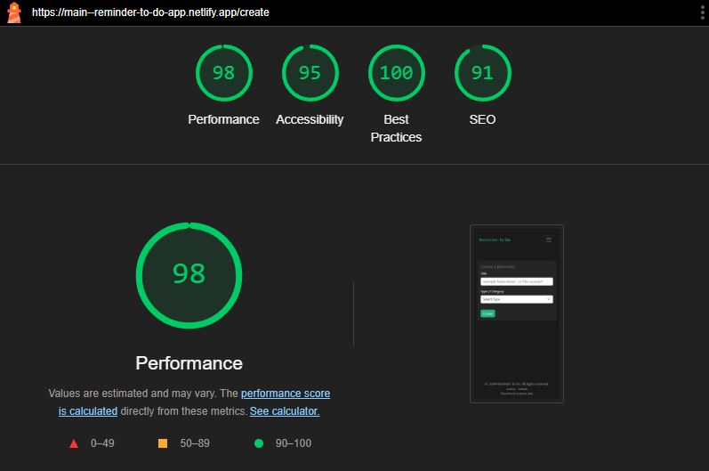
 |    ✅    |
| ProfileView            | 94 / 100              | 

Screenshot of result
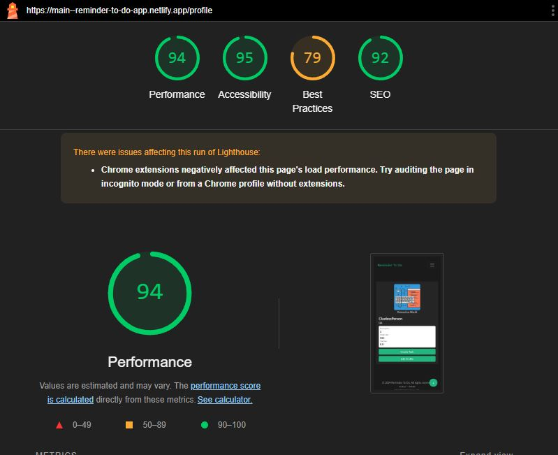
 |    ✅    |
| SignUpView             | 99 / 100              | 

Screenshot of result
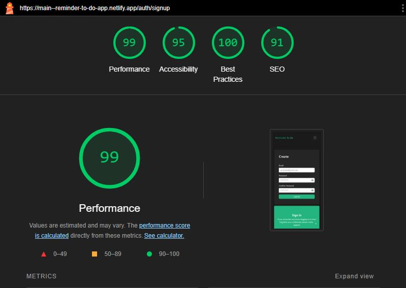
 |    ✅    |
| SignInView             | 99 / 100              | 

Screenshot of result
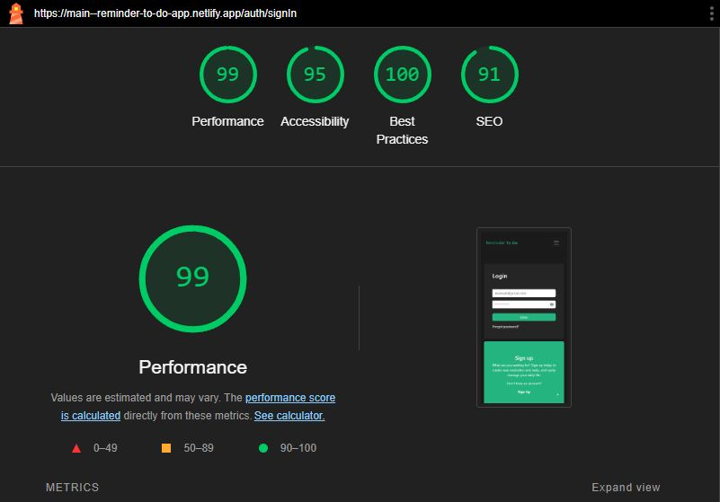
 |    ✅    |

In terms of performance, Reminder To Do website delivered strong results, ensuring a seamless user experience on both desktop and mobile platforms.

(<a href="#table-of-content">back to top</a>)

  

## Performing tests on various devices

The website was tested on the following devices:

<ins>Mobile</ins>

1. Samsung s22 ultra
2. iPhone X
3. Samsung galaxy s22
4. iPhone 14 Pro max

<ins>Desktop</ins>

1. Samsung Galaxy Book 360
2. HP Elite book 830 g9
3. HP Victus gaming desktop

<ins>Monitors</ins>

1. 49-inch Samsung CHG9 ultra-wide
2. 27-inch Benq zowie XL2746S
3. 27-inch Dell ultrasharp U2723QE

In addition, the website was tested using the Google Chrome Developer Tools Device Toggling option for all available device options.

(<a href="#table-of-content">back to top</a>)

  

## Browser compatibility

The website was tested on the following:

<ins>Browsers</ins>

1. Microsoft Edge
2. Google Chrome
3. Mozilla Firefox
4. Safari

(<a href="#table-of-content">back to top</a>)

  

## Automated Testing

Autmated Testing was not implemented at this time in this project. But this will be come available in near future!

(<a href="#table-of-content">back to top</a>)

  

## Manual Testing

### Testing user stories

### User Experience and Improvements

I engaged in user testing involving family members and friends to collect feedback regarding their website experience. I requested them to complete the following tasks and share their feedback on their overall experience:

Total users attended the testing: 3

| Test                    | Result   |
| ----------------------- | -------- |
| Create an account       | **100%** |
| Update the profile      | **100%** |
| Upload a profile img    | **100%** |
| Create a reminder       | **100%** |
| Update a reminder       | **100%** |
| Delete a reminder       | **100%** |
| Add task to reminder    | **100%** |
| Edit task to reminder   | **100%** |
| Delete task to reminder | **100%** |
| Search for a Reminder   | **100%** |
| Filter for a Reminder   | **100%** |
| Test all links          | **100%** |
| Try forgot password     | **100%** |
| Delete account          | **100%** |

&nbsp;

(<a href="#table-of-content">back to top</a>)

  

# Summary

### Performance

- **Desktop Performance:**

  - Average performance score: 100 / 100
  - Majority of pages received score 100 / 100, indicating excellent performance.

- **Mobile Performance:**
  - Average performance score: 97.6 / 100
  - Pages showed slightly lower performance compared to desktop but maintained a satisfactory score.

### Device Testing

The website was tested on a variety of devices, including mobile phones (_Samsung s22 ultra_, _iPhone X_, _Samsung galaxy s22_, _iPhone 14 Pro max_), desktops (_Samsung Galaxy Book 360_, _HP Elite book 830 g9_, _HP Victus gaming desktop_), and monitors (_49-inch Samsung CHG9 ultra-wide_, _27-inch Benq zowie XL2746S_, _27-inch Dell ultrasharp U2723QE_). Additionally, testing was performed using Google Chrome Developer Tools Device Toggling for various device options.

### Browser Compatibility

The website was tested on popular browsers, ensuring compatibility with:

1. Microsoft Edge
2. Google Chrome
3. Mozilla Firefox
4. Safari

### Automated Testing

Automated testing has not been implemented in the current project but is planned for future development.

### Manual Testing

User stories and various scenarios were tested manually, involving family members and friends. The success rate for tasks such as account creation, profile updates, product interactions, and more was 100%.

### Overall User Experience

Feedback from user testing and manual testing indicates a seamless user experience. The website performed well in terms of functionality, responsiveness, and user interface across different devices and browsers.

The testing process was comprehensive, covering various aspects of the website, and the identified issues have been documented for further improvement.

(<a href="#table-of-content">back to top</a>)

  

